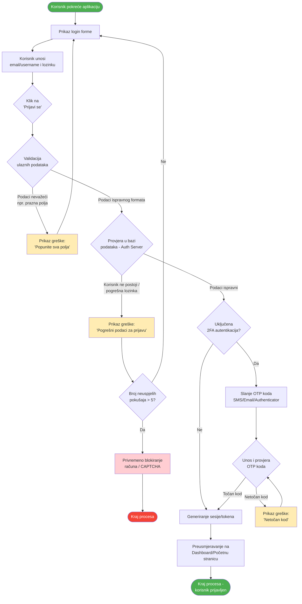

```mermaid
flowchart TD
    Start([Korisnik pokreće aplikaciju]) --> LoginForm[Prikaz login forme]
    LoginForm --> Input[Korisnik unosi<br/>email/username i lozinku]
    Input --> Submit{Klik na<br/>'Prijavi se'}
    
    Submit --> Validate{Validacija<br/>ulaznih podataka}
    
    Validate -->|Podaci nevažeći<br/>npr. prazna polja| ShowValError[Prikaz greške:<br/>'Popunite sva polja']
    ShowValError --> LoginForm
    
    Validate -->|Podaci ispravnog formata| CheckAuth{Provjera u bazi<br/>podataka - Auth Server}
    
    CheckAuth -->|Korisnik ne postoji /<br/>pogrešna lozinka| ShowAuthError[Prikaz greške:<br/>'Pogrešni podaci za prijavu']
    ShowAuthError --> AttemptCount{Broj neuspjelih<br/>pokušaja > 5?}
    AttemptCount -->|Da| LockAccount[Privremeno blokiranje<br/>računa / CAPTCHA]
    LockAccount --> End1([Kraj procesa])
    AttemptCount -->|Ne| LoginForm
    
    CheckAuth -->|Podaci ispravni| Check2FA{Uključena<br/>2FA autentikacija?}
    
    Check2FA -->|Ne| GenerateSession[Generiranje sesije/tokena]
    Check2FA -->|Da| Send2FA[Slanje OTP koda<br/>SMS/Email/Authenticator]
    Send2FA --> Verify2FA{Unos i provjera<br/>OTP koda}
    Verify2FA -->|Netočan kod| Show2FAError[Prikaz greške:<br/>'Netočan kod']
    Show2FAError --> Verify2FA
    Verify2FA -->|Točan kod| GenerateSession
    
    GenerateSession --> RedirectDash[Preusmjeravanje na<br/>Dashboard/Početnu stranicu]
    RedirectDash --> End2([Kraj procesa -<br/>korisnik prijavljen])

    style Start fill:#4CAF50,color:#fff
    style End1 fill:#f44336,color:#fff
    style End2 fill:#4CAF50,color:#fff
    style ShowValError fill:#ffecb3
    style ShowAuthError fill:#ffecb3
    style Show2FAError fill:#ffecb3
    style LockAccount fill:#ffcdd2
```